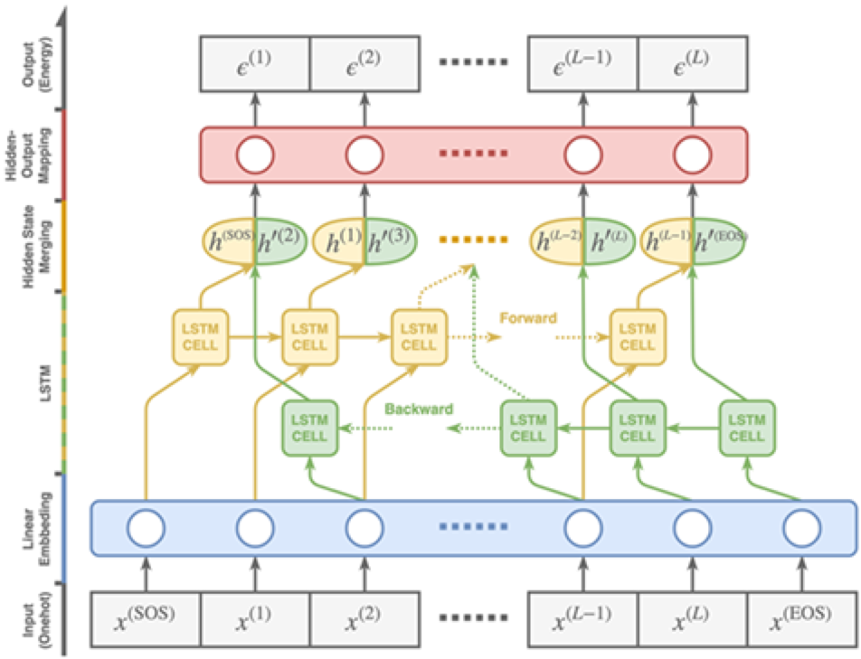

# Quantifying the nativeness of antibody sequences using long short-term memory networks

This work is published in Protein Engineering Design & Selection journal (https://academic.oup.com/peds/advance-article/doi/10.1093/protein/gzz031/5554642).

#Citation: 
Wollacott AM, Xue C, Qin Q, Hua J, Bohnuud T, Viswanathan K, Kolachalama VB. Quantifying the nativeness of antibody sequences using long short-term memory networks. Protein Eng Des Sel. 2019 Dec 31;32(7):347-354.

 

## Getting Started

These instructions will get you a copy of the project up and running on your local machine for development and testing purposes.

### Prerequisites

The tool was developped based on the following dependencies:

1. PyTorch (1.1 or greater).
2. NumPy (1.16 or greater).
3. tqdm (4.31 or greater).

Please note that the dependencies may require Python 3.6 or greater. It is recommended to install and maintain all packages using [`conda`](https://www.anaconda.com/) or [`pip`](https://pypi.org/project/pip/). For installation of GPU accelerated PyTorch, additional effort may be required. Please check the official websites of [PyTorch](https://pytorch.org/get-started/locally/) and [CUDA](https://developer.nvidia.com/cuda-downloads) for detailed instructions.

### Installation

This is a lightweight project targeting the problem related to quantifying the nativeness of antibody sequences and therefore, no sophisticated installation routine is required. All you need is to place it into your project repository and import at need. If you want to put it somewhere else, please check out [importlib.util](https://docs.python.org/3/library/importlib.html) module for more flexible import capability.

## How to use

These instructions will help you to properly configure and use the tool either through function-call or command-line. For detailed usage of the parameters, you may refer to [Documentation](#documentation) section.

### Data file format

All antibody protein sequences must be stored in plain-text format. A sequence consists of 20 amino acid symbol letters along with `"-"` to indicate gap, and sequences are delimited by one single line-break. Please do not include spaces or extra line-breaks. You can find sample data files under `<project_root>/data/sample/`

Here we provide an example:
```
-QVQLVQS-GAEVKKPGSSVKVSCTTSG-GTFSS-----FVINWMRQAPGQGLGWRGGIMPV---
-EVQLLES-GGGLVQPGGSLRLSCAGSG-FTFSS-----YAMSWVRQTPGKGLEWVSVISGS---
-QVQLVES-GGGVVQSGRSLRLSCAASG-FTFRS-----HAIHWVGQAPGKGLEGVGVMSHD---
-QVHLVQS-GAEVHKPGASLRISCKASG-YTFPN-----FFLHWVRQAPGQGLEWMGIINPI---
-QVQLQES-GPGLMKPSGTLSLTCDVSG-ASISN----TNWWGWVRQPPGLGLEWIGEIHH----
```

### Call within Python script

To initialize model:
```python3
from ablstm import ModelLSTM
model = ModelLSTM(embedding_dim=64, hidden_dim=64, device='cpu', gapped=True, fixed_len=True)
```

To fit model (without saving):
```python3
trn_fn = './data/sample/human_train.txt'
vld_fn = './data/sample/human_val.txt'
model.fit(trn_fn=trn_fn, vld_fn=vld_fn, n_epoch=10, trn_batch_size=128, vld_batch_size=512, lr=.002, save_fp=None)
```

To score sequences:
```python3
tst_fn = './data/sample/human_test.txt'
tst_scores = model.eval(fn=tst_fn, batch_size=512)
```

To save and load model:
```python3
model.save(fn='./saved_models/tmp/model_tmp.npy')
model_loaded = ModelLSTM()
model_loaded.load(fn='./saved_models/tmp/model_tmp.npy')
```

### Call via command-line

#### XML configuration

Since the neural network may have numerous parameters to configure, it may appear excessively verbose if we pass all of them by commands. Most of the model parameters, therefore, are stored within `<project_root>/ablstm.config` in XML format. The structure and the tag names exactly follow their corresponding Python class definition.

Here is the default configuration XML file.
```xml
<?xml version="1.0"?>
<ablstm>
    <__init__>
        <embedding_dim>64</embedding_dim>
        <hidden_dim>64</hidden_dim>
        <gapped>True</gapped>
        <fixed_len>True</fixed_len>
    </__init__>
    <fit>
        <n_epoch>8</n_epoch>
        <trn_batch_size>128</trn_batch_size>
        <vld_batch_size>512</vld_batch_size>
        <lr>0.002</lr>
    </fit>
    <eval>
        <batch_size>512</batch_size>
    </eval>
</ablstm>
```

#### Example

To start fresh training:
```bash
python ablstm.py fit ./data/sample/human_train.txt ./data/sample/human_val.txt ./saved_models/tmp
```

To load a saved model and resume training:
```bash
python ablstm.py fit ./data/sample/human_train.txt ./data/sample/human_val.txt ./saved_models/tmp -l ./saved_models/tmp/model_tmp.npy
```

To use a configuration file other than `<project_root>/ablstm.config`:
```bash
python ablstm.py fit ./data/sample/human_train.txt ./data/sample/human_val.txt ./saved_models/tmp -c ./ablstm_new.config
```

To evaluate sequence scores using a saved model:
```bash
python ablstm.py eval ./data/sample/human_test.txt ./saved_models/tmp/model_tmp.npy ./results/result_human_test.txt
```

## <a name="documentation"></a>Documentation

### Class methods

#### `ablstm.ModelLSTM.__init__()`
> Initializes an LSTM model with the given parameters.

Parameters:

1. `embedding_dim`: *int, default is 64*
>> Embedding layer dimensions.
2. `hidden_dim`: *int, default is 64*
>> Hiddden layer dimensions.
3. `device`: *str, default is 'cpu'*
>> Device that the model will be mounted on. If GPU is available and CUDA is properly installed, you can assign `"cuda:0"` (or `"cuda:<DEVICE_INDEX>"` if you have more GPUs) that will greatly accelerate training and evaluation process.   
4. `gapped`: *bool, default is True*
>> Indicate whether the input sequences contain gaps. A gap is always denoted as `"-"`.
5. `fixed_len`: *bool, default is True*
>> Indicate whether the input sequences share equal length. It can be set `False` without any issue in all circumstances, but when the sequence lengths are assured to be the same, setting it `True` will help speed up the computation significantly.

#### `ablstm.ModelLSTM.fit()`
> Fit the model using the given training and validation data.

Parameters:

1. `trn_fn`: *str*
>> Data file for training.
2. `vld_fn`: *str*
>> Data file for validation.
3. `n_epoch`: *int, default is 10*
>> Number of epochs.
4. `trn_batch_size`: *str, default is 128*
>> Batch size during training. `-1` means whole batch.
5. `vld_batch_size`: *str, default is 512*
>> Batch size during validation. `-1` means whole batch.
6. `lr`: *float, default is 0.002*
>> Learning rate. The fitting process uses Adam algorithm for optimization.
7. `save_fp`: *str, optional, default is None*
>> Path to save models. `None` or `""` means training without saving. If a valid path is given, model will be saved under the path after each epoch as long as the validation performance is better than the past.

#### `ablstm.ModelLSTM.eval()`
> Scores the given sequences.

Parameters:

1. `fn`: *str*
>> Data file for evaluation.
2. `batch_size`: *int, default is 512*
>> Batch size. -1 means whole batch.

Returns:

1. `scores`: *NumPy ndarray*
>> 1-D NumPy array consists of all sequences' scores. Order is preserved.

#### `ablstm.ModelLSTM.to()`
> Assign device.

Parameters:
1. `device`: *str, default is "cpu"*
>> Device to mount.

#### `ablstm.ModelLSTM.save()`
> Save model.

Parameters:

1. `fn`: *str*
>> Save file name.

#### `ablstm.ModelLSTM.load()`
> Load model from the given file. Please note that when `load()` method is invoked, all parameters will be overloaded except `device`. You may call `ablstm.ModelLSTM.to()` method to switch among different devices.

Parameters:

1. `fn`: *str*
>> Model file name.

Returns:

1. `model`: *ablstm.ModelLSTM*
>> Loaded model.

### Command line

#### `fit` manual
```bash
usage: ablstm.py fit [-h] [-l L] [-c C] [-d D] TRN_FN VLD_FN SAVE_FP

positional arguments:
  TRN_FN      training data file
  VLD_FN      validation data file
  SAVE_FP     model save path

optional arguments:
  -h, --help  show this help message and exit
  -l L        model file to load (default: "")
  -c C        configuration XML file (default: "./ablstm.config")
  -d D        device (default: "cpu")
```

#### `eval` manual
```bash
usage: ablstm.py eval [-h] [-c C] [-d D] TST_FN MDL_FN SCR_FN

positional arguments:
  TST_FN      evaluation data file
  MDL_FN      model file to load
  SCR_FN      file to save scores

optional arguments:
  -h, --help  show this help message and exit
  -c C        configuration XML file (default: "./ablstm.config")
  -d D        device (default: "cpu")
```

## Authors

* **Chonghua Xue**, cxue2@bu.edu - Kolachalama laboratory, Boston University School of Medicine


## Acknowledgments

* Visterra Inc., Waltham, MA, USA
